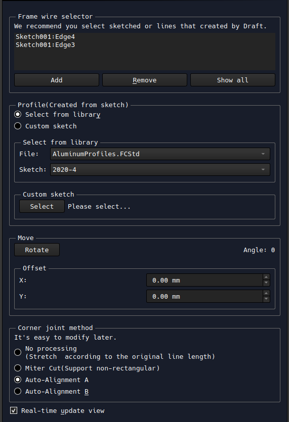
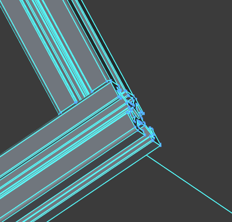
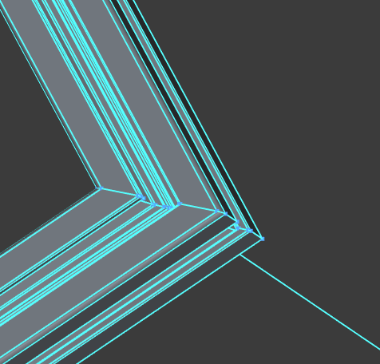
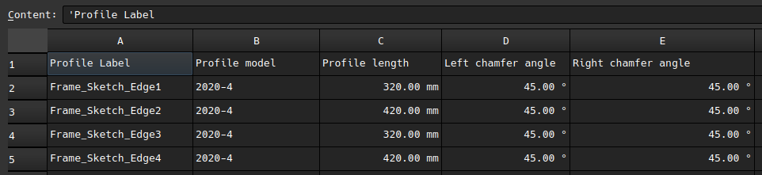

# EasyProfileFrame
A FreeCAD workbench designed to simplify the creation of frames using profiles, such as aluminum profiles. It also includes support for exporting Bill of Materials (BOM).

<video controls>
  <source src="./docs/vid.mp4" type="video/mp4">
  <source src="https://github.com/ovo-Tim/EasyProfileFrame/raw/refs/heads/main/docs/vid.mp4" type="video/mp4">
</video>
(The video has been edited)

## Features

- Process joint automatically

- Real time preview
- BOM export

## Countributors
Thanks icons come from [MakerWorkbench](https://github.com/URJCMakerGroup/MakerWorkbench)
- [（Mechanical Engineer）]()